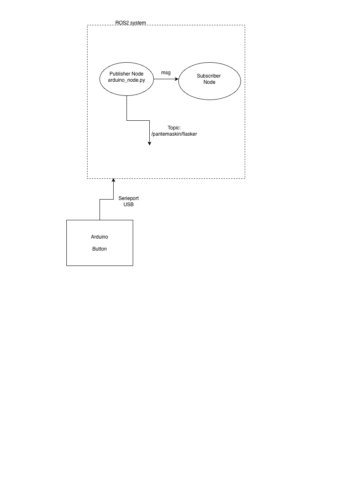

# Pantesystem

- Simulation of a return deposit of flask with ROS2, Docker, Python and arduino.

Arduino - Mac (USB/serial)
- Arduino sends JSON-msg through USB to Mac every type the button is pressed.

Mac - docker (Volume)
- The code files on my Mac are shared with the Docker container through volume. In order to use access the files easier and use git.

Node - Node (ROS2 topics)
- The arduino_node publish msgs to the topic /pantemaskin/flasker. Any node which is subscribed to the topic recives the msg. 

## Files

### Arduino-code 
- pantemaskin.ino
- Will simulate the deposit return of flask. Every third flask rejected.
- Send JSON through the serieport 

### ROS2 - node
- arduino_node.py 
- if hardware not connected, it will generate a random flask (75% accepted, 25% reject), and publish in form of JSON in a ROS2 msg on /pantemaskin/flasker

### Hardware connection/ arduino setup

The arduino-setup on website: 
https://wokwi.com/projects/457219819086737409

## Potential adjustments

- There was some difficulties to connect the USB port to the Docker, since it does not have access/it got lost in Linux VM. I could try to run the arduino_node on my mac, but then it would require to install ROS2 on mac. I read that there might be some dependency issues with Homebrew, and the best is to use ubuntu via Docker.